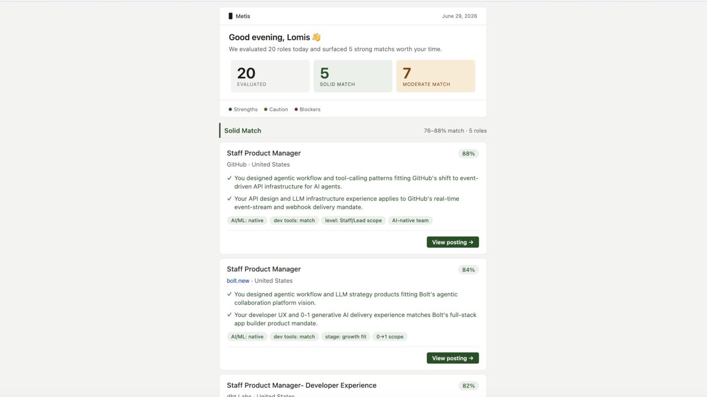
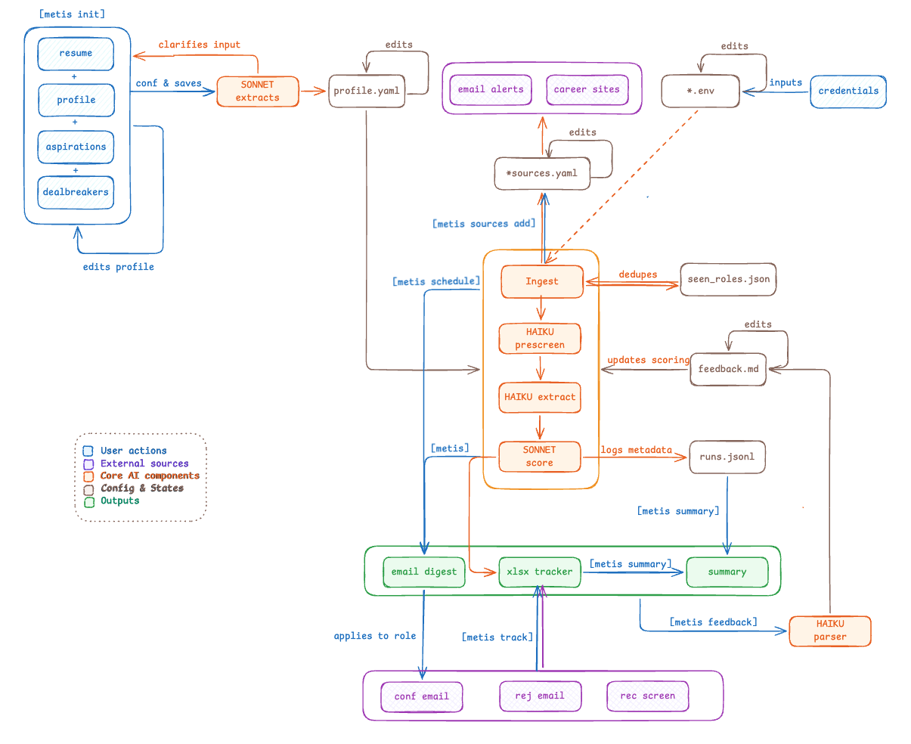

# metis

**Spend your time and energy on roles that matter.**

Metis is an AI-powered career agent that automates the first round of job discovery by screening and ranking new opportunities against your profile, experience, career goals, and deal breakers. It consolidates roles from job alerts and company career pages, compares them to your background, and delivers a personalized scored digest on a schedule you control. It can also track applications and recruiter responses in a spreadsheet, then generate summaries that show how your search is progressing over time.

Think of it as a personal decision agent for high-volume opportunity triage: it helps you decide what deserves attention, what can wait, and what is not worth your time.

[](LICENSE)
[](https://www.python.org/downloads/)
[](https://github.com/chenlomis/metis/actions/workflows/test.yml)
[](#testing)
[](#env-configuration)



## See it in 60 seconds

```bash
metis
```

metis reads new job alerts, scores each role against your profile, and emails a ranked digest. A typical card answers the question you actually care about:

> **Solid Match · 91/100**  
> Why it fits: your 0-to-1 ML platform work maps to the role.  
> Watch-out: first 90 days may lean more onsite than your preference.

<!--
Demo video note:
Upload the local demo MP4 to a GitHub Release or issue comment,
then replace the placeholder below with the generated GitHub asset URL.
Avoid committing the MP4 directly; it is over 100 MB.
-->
<!-- [Watch the demo](https://github.com/chenlomis/metis/assets/REPLACE_ME) -->

---

**Jump to:**
[What it does](#what-it-does) •
[How it works](#how-it-works) •
[Prerequisites](#prerequisites) •
[Quick start](#quick-start) •
[Commands](#commands) •
[Project files](#project-files) •
[Roadmap](#roadmap) •
[Contributing](#contributing)

---

## What it does

**Profile setup (`metis init`).** This interactive wizard builds your profile by reading your resume and LinkedIn profile, then asking about your aspirations, preferences, and deal breakers. The configured LLM provider uses that context to generate `profile.yaml`, which every future scoring run is evaluated against. You can rerun the wizard or edit the file directly at any time.

On first setup, metis prompts you to connect Gmail or Outlook in the browser so it can read job-alert emails and send digests from your own account. You can also add company career-page sources and enable automated delivery during setup, or reconfigure them later with `metis config access`, `metis sources add`, and `metis schedule set`.

**Email digest (`metis`).** Each run ingests new roles from all configured sources, deduplicates across runs, extracts relevant info, and scores each role through a multi-stage LLM pipeline. The end result is an HTML email digest with scored roles. Every JD gets a categorical verdict and a 0-100 score:

- Solid Match (75+): roles worth prioritizing
- Moderate Match (55-74): roles worth a closer look
- Limited Match (below 55): roles that do not clear the bar

Each evaluation surfaces two strengths and one potential friction point, alongside normalized tags for a quick scan. Roles in the Solid Match and Moderate Match tiers are automatically written to `applications.xlsx` to kickstart application tracking.

**Application tracking (`metis track`).** After you apply, this command scans your inbox for confirmation, rejection, and recruiter emails and updates `applications.xlsx`.

**Progress reporting (`metis summary`).** High-level insights across score distribution, verdict trends, and application rates. Useful both for tracking how your search has evolved and for spotting patterns that help calibrate your profile over time.

**Feedback tuning (`metis feedback`).** After reviewing the digest, app tracker, or overall summary, you can provide generic or specific feedback via this command, such as "seed-stage roles keep scoring high but I always skip them." The system parses it, asks you to confirm the signal, and injects it into future scoring runs as a high-priority calibration note.

---

## How it works

Metis is designed as a modular, stateful pipeline composed of loosely coupled subsystems connected through persistent artifacts rather than in-memory state. Instead of a single monolithic prompt, each stage has a focused responsibility—from profile construction and source ingestion to lightweight pre-screening, structured extraction, deep semantic evaluation, reporting, and feedback incorporation. This separation keeps the system observable, debuggable, and easily extensible.

The runtime operates as a closed-loop agentic workflow. New roles are continuously discovered, deduplicated, evaluated against a structured user profile, surfaced through personalized digests, tracked through recruiting outcomes, and refined using explicit user feedback. Every run persists metadata and intermediate artifacts (`profile.yaml`, `email_sources.yaml`, `runs.jsonl`, `feedback.md`, etc.), enabling reproducibility, debugging, and future iteration without relying on opaque prompt state.

The overall architecture prioritizes modularity, cost-aware inference, privacy-first local state, and continuous learning, allowing individual components to evolve independently as better models, data sources, or evaluation strategies become available.



See [ARCHITECTURE.md](./ARCHITECTURE.md) for data flow diagrams and notes on extending each layer.

### Project files

```
metis/
  cli.py           # CLI parsing and command routing
  pipeline.py      # Digest pipeline orchestration
  score.py         # LLM scoring logic
  extract.py       # Structured JD extraction
  profile.py       # Profile loader
  prompts.py       # Canonical prompt templates
  init_cmd.py      # metis init profile setup wizard
  render.py        # HTML digest renderer
  report_cmd.py    # metis summary report
  feedback.py      # Feedback log and calibration parser
  sources_cmd.py   # metis sources command
  track.py         # metis track email parsing
  xlsx.py          # applications.xlsx read/write
  trace.py         # runs.jsonl telemetry
  schedule_cmd.py  # metis schedule wizard
  state.py         # Dedup state
  theme.py         # Rich and InquirerPy theme
  sources/         # Email and career-page ingestion

emails/            # React Email digest templates
tests/             # pytest suite
profile.template.yaml
.env.example
Makefile
```

The CLI surface is listed in [Commands](#commands).

### Local runtime files

metis keeps personal runtime state under `~/.job_pipeline/`:

| File | Purpose |
|------|---------|
| `profile.yaml` | Your active scoring profile. Edit this when your goals, constraints, or resume story changes. |
| `.env` | Your local config. Most users only edit the LLM provider/key and optional recipient email. |
| `applications.xlsx` | Your application tracker. Solid and Moderate matches land here so you can follow up and report on outcomes. |
| `seen_roles.json` | Dedup memory. This keeps the same role from showing up again and again. |
| `runs.jsonl` | Scoring trace. Useful when a score feels off or `metis summary` needs history. |
| `feedback.md` | Calibration notes from `metis feedback`, injected into future scoring runs. |
| `*_token.json` | Local Gmail/Outlook OAuth tokens created after browser login. |

These files are personal and should not be committed.

---

## Prerequisites

Plan for about **5-10 minutes** to get set up, plus up to 24 hours for the first LinkedIn alert email to arrive if you just created a new alert.

| What | Status | Why | How to get it |
|------|--------|-----|---------------|
| Python 3.11+ | **Required** | Runs the CLI. macOS ships with 3.9, which is too old. | [python.org/downloads](https://www.python.org/downloads/) or `brew install python@3.11` |
| LLM API key | **Required, save for [`.env`](#env-configuration)** | Scores roles against your profile. Without this, metis cannot evaluate jobs. | [Anthropic Console](https://console.anthropic.com) or [OpenAI API keys](https://platform.openai.com/api-keys) |
| Gmail or Outlook account | **Required** | Inbox for job alerts and sender for digests. | Connect in the browser during `metis init`. |
| Job alerts | **Recommended** | Fastest way to get useful roles into metis. LinkedIn saved alerts are the best-tested source. | See [Setting up LinkedIn alerts](#linkedin-alerts). |
| Resume | **Required** | The premise for scoring. The richer the resume, the better the profile. | PDF, DOCX, or TXT anywhere on your machine. |

**Notes**

- macOS and Linux are supported. Windows via WSL2 should work but is untested.
- Node.js 18+ is optional. It enables the polished React Email renderer; without it, metis uses a simpler Python HTML fallback.
- Metis uses a provider-neutral LLM boundary. Anthropic and OpenAI are supported today across `metis`, `metis init`, `metis feedback`, and tracker LLM fallback; Gemini and Grok/XAI are adapter extensions.

<a id="linkedin-alerts"></a>

### Setting up LinkedIn alerts

metis reads emails that LinkedIn sends you. It does not scrape LinkedIn. You need at least one alert email in your inbox before the first run.

1. Go to [LinkedIn Jobs](https://www.linkedin.com/jobs/) and search for your target role and location
2. Click **Set alert** (the bell icon near the search bar)
3. Set frequency to **Daily**
4. Repeat for each search you want to track

LinkedIn sends one email per saved search per day, listing 5-10 new roles. metis reads all of them.

metis reads emails from these three LinkedIn senders:
- `jobalerts-noreply@linkedin.com` - "Your job alert for X" digests
- `jobs-noreply@linkedin.com` - "Company is hiring" / "Jobs similar to X" recommendations
- `jobs-listings@linkedin.com` - "Jobs you might like" (JYMBII) digests

Both multi-job digests and single-role notifications are supported.

<a id="env-configuration"></a>

### `.env` configuration

Your personal config lives here:

```bash
~/.job_pipeline/.env
```

For normal setup, this file only needs your chosen LLM provider and API key. Use one of:

```bash
METIS_LLM_PROVIDER=anthropic
ANTHROPIC_API_KEY=sk-ant-...
```

```bash
METIS_LLM_PROVIDER=openai
OPENAI_API_KEY=sk-...
```

Optional knobs:

| Value | Use it when |
|-------|-------------|
| `RECIPIENT_EMAIL` | You want digests sent somewhere other than the connected inbox. |
| `MAX_JOBS_PER_RUN` | You want a different per-run scoring cap. Default: `40`; `0` means no cap. |
| `DEFAULT_LOOKBACK` | You want each run to search farther back than `3d`. |

Open the file in Finder with **Go > Go to Folder...** and paste `~/.job_pipeline`. Browser login handles Gmail/Outlook access during `metis init`, so normal users do not need an app password.

---

## Quick start

**Step 1 — Install**

```bash
brew install pipx && pipx ensurepath
pipx install git+https://github.com/chenlomis/metis.git
```

> Already installed? Run `pipx upgrade metis-job` instead.

**Step 2 — Configure credentials**

```bash
mkdir -p ~/.job_pipeline
cat > ~/.job_pipeline/.env << 'EOF'
METIS_LLM_PROVIDER=openai       # or anthropic
OPENAI_API_KEY=sk-...           # or ANTHROPIC_API_KEY=sk-ant-...
EOF
```

Then open `~/.job_pipeline/.env`, choose `openai` or `anthropic`, and paste the matching key. See [`.env` configuration](#env-configuration) for both examples.

**Step 3 — Build your scoring profile**

```bash
metis init
```

On first setup, metis prompts you to choose Gmail or Outlook and connect in the browser. You can switch or reconnect later with `metis config access`.

**Step 4 — Run**

```bash
metis
```

> **Optional — Playwright-powered company sourcing:** metis can also pull roles directly from company career pages (Greenhouse, Lever, Ashby). This requires Playwright and is disabled by default. To enable:
> ```bash
> pipx inject metis-job playwright --include-apps
> playwright install chromium
> # Then: metis sources add Stripe
> ```

**Expected output:** metis fetches LinkedIn alert emails from the last 3 days, scores each role, and emails you a ranked digest. On first run this usually takes 30-90 seconds for small batches, and longer if many roles need JD extraction and scoring.

> **No emails found?** LinkedIn alert emails may take up to 24 hours to arrive after setup. Run `metis --lookback 14d` to cast a wider net, or see [Troubleshooting](#troubleshooting).

---

## Commands

### Core workflow

| Command                              | What it does                                                                            |
|--------------------------------------|-----------------------------------------------------------------------------------------|
| `metis`                              | Run full pipeline: ingest, dedupe, score, and email digest. Default: last run or 3d.    |
| `metis --lookback 7d`                | Same pipeline with a wider window. Accepts `7d`, `14d`, or ISO date like `2026-05-10`.  |
| `metis --dry-run`                    | Preview a full fetch + score run without sending email or writing state.                |
| `metis --no-limit`                   | Score everything in the window. The fast pre-screen model runs first.                   |
| `metis --no-limit --lookback 14d`    | Catch up after a gap by scoring everything from a wider window.                         |
| `metis init`                         | Build your scoring profile from your resume and preferences.                            |
| `metis config access`                | Connect, inspect, switch, or reconnect Gmail/Outlook access.                            |

Each digest role gets a 0-100 score, a Solid Match / Moderate Match / Limited Match verdict, two leverage points, one friction point, and scan-friendly tags. Roles are deduplicated across runs, so the same listing should not reappear within 30 days.

`profile.yaml` is the scoring profile used by every future digest. See [profile.template.yaml](./profile.template.yaml) for the full schema with comments.

### Sources and scheduling

| Command                              | What it does                                                                            |
|--------------------------------------|-----------------------------------------------------------------------------------------|
| `metis sources [list]`               | Show active email alerts and company career pages.                                      |
| `metis sources add`                  | Pick an alert source or company source interactively.                                   |
| `metis sources add NAME`             | Add a company for proactive scraping. Auto-detects Greenhouse, Lever, or Ashby.         |
| `metis sources add --all`            | Add every company in the built-in pool.                                                 |
| `metis sources remove`               | Remove company sources interactively.                                                   |
| `metis sources on`                   | Turn company career-page scraping on.                                                   |
| `metis sources off`                  | Turn company scraping off without losing your company list.                             |
| `metis sources email`                | Show built-in LinkedIn alerts and any extra email alert sources.                        |
| `metis sources email add`            | Add an email alert source interactively, or pass a sender address to skip the wizard.   |
| `metis sources email add <sender>`   | Fetch a recent email from that sender, preview parsed jobs, confirm in one step.        |
| `metis sources email remove`         | Remove a non-LinkedIn email alert source interactively.                                 |
| `metis schedule`                     | Show current digest schedule and OS job status.                                         |
| `metis schedule set`                 | Set up automated daily or weekly digest delivery.                                       |
| `metis schedule pause`               | Pause the schedule without deleting it.                                                 |
| `metis schedule resume`              | Resume a paused schedule.                                                               |
| `metis schedule remove`              | Remove the scheduled job.                                                               |

LinkedIn alert senders are built in. Company sourcing can pull roles directly from Greenhouse, Lever, and Ashby career pages without waiting for a LinkedIn alert email.

### Tracking, reporting, and feedback

| Command                              | What it does                                                                            |
|--------------------------------------|-----------------------------------------------------------------------------------------|
| `metis track`                        | Parse inbox for application outcomes and update `applications.xlsx`.                    |
| `metis track --lookback 30d`         | Scan a wider email window.                                                              |
| `metis track --dry-run`              | Print matches without writing to the tracker.                                           |
| `metis summary`                      | Generate and email progress report with score trends and search insights.               |
| `metis summary --lookback 60d`       | Scope market intel to a 60-day window. Default is 30d.                                  |
| `metis summary --output report.html` | Save the report as HTML instead of sending it.                                          |
| `metis summary --output report.pdf`  | Save the report as PDF instead of sending it.                                           |
| `metis summary --preview`            | Send the report with a `[DRAFT PREVIEW]` subject prefix.                                |
| `metis feedback`                     | Add calibration notes that improve future scoring runs.                                 |
| `metis feedback add`                 | Same as `metis feedback`.                                                               |
| `metis feedback list`                | Show recent feedback entries.                                                           |

`metis track` recognizes confirmations, rejections, and recruiter-screen emails. Feedback is parsed by the configured LLM provider, confirmed before saving, and injected into future scoring runs.

### State and debugging

| Command                              | What it does                                                                            |
|--------------------------------------|-----------------------------------------------------------------------------------------|
| `metis reset`                        | Clear dedup state so old roles can appear again. Keeps your profile.                    |
| `metis reset --force`                | Clear dedup state without asking for confirmation.                                      |
| `metis reset --profile`              | Also delete your scoring profile. Run `metis init` before the next digest.              |
| `metis reset --profile --force`      | Delete dedup state and profile without asking for confirmation.                         |
| `metis debug`                        | Save the most recent LinkedIn alert email to `~/.job_pipeline/debug_email.txt`.         |

For explainability, metis keeps more detail locally than it shows in the email. The digest stays intentionally compact, but `~/.job_pipeline/runs.jsonl` records each scored role with model inputs, verdict, dimension scores, tags, leverage points, friction points, and gate/filter reasons. If a score feels off, inspect `runs.jsonl`, then use `metis feedback` to calibrate future runs.

---

## Privacy

metis is local-first. Your profile, tracker, run history, feedback, and OAuth tokens live under `~/.job_pipeline/` on your machine.

What leaves your machine:

- Your selected LLM provider sees the resume/profile text, job descriptions, and feedback needed to score roles.
- Gmail or Outlook sees the normal OAuth requests needed to read alert emails and send digests from your account.
- Nothing is sent to unconfigured LLM providers.

Your API keys and OAuth tokens stay local except when used to authenticate with the service they belong to. Review your provider's policy before running: [Anthropic privacy](https://www.anthropic.com/privacy) or [OpenAI privacy](https://openai.com/policies/privacy-policy).

---

## Cost

Scoring cost depends on provider, model, and how many roles survive pre-screening. A typical 10-job batch is designed to stay low-cost by using a fast pre-screen pass before full scoring; set provider-specific model variables such as `OPENAI_MODEL` or `ANTHROPIC_MODEL` to control the tradeoff.

Runtime depends on how many roles survive deduplication and pre-screening. A larger run may make several model calls: fast pre-screening, structured JD extraction, then full scoring. metis logs chunk progress while it works so long runs do not look frozen.

When more than `MAX_JOBS_PER_RUN` new roles appear (default: 40), metis pauses and shows the count and estimated cost before proceeding. The estimate is provider-aware for the built-in Anthropic/OpenAI defaults and can be overridden with `METIS_COST_PER_ROLE_LOW` / `METIS_COST_PER_ROLE_HIGH` if you use custom models or pricing. If you choose fewer than the available roles, metis pre-screens the full batch, scores the freshest roles up to your chosen count, and stores the remaining pre-screen survivors in `role_queue.json` for the next run. They are never silently discarded or marked seen before scoring.

Set `MAX_JOBS_PER_RUN=0` in `.env` to remove the cap. For rate-limit-prone providers, tune `METIS_LLM_MAX_ATTEMPTS`, `METIS_LLM_RETRY_BASE_SECONDS`, and `METIS_LLM_TIMEOUT_SECONDS`.

---

<a id="roadmap"></a>

## Current limits and roadmap

metis is a local, CLI-first v0. It works best today with Gmail or Outlook job-alert emails, a supported LLM provider key, and a user who wants high-signal triage more than mass-apply automation.

Near-term roadmap:

- More alert sources and company/ATS adapters
- Additional LLM adapters, such as Gemini and Grok/XAI
- MCP server and importable core API
- PyPI and Docker packaging
- Output targets beyond email, such as Markdown, Slack, Notion, or webhooks
- Deeper analytics over score trends, tracker outcomes, and market signals
- Resume tailoring and application-assist workflows, with human approval before anything is submitted
- Web UI or local dashboard only if there is clear demand from non-CLI users

See [open issues](https://github.com/chenlomis/metis/issues) for the full list.

---

## Troubleshooting

Start with the earliest step that matches what you are seeing. Most issues are setup, inbox access, alert delivery, or local state.

**`metis: command not found` after install**

Run `pipx ensurepath`, open a new terminal, and try `metis --help`. If that works, your shell can find the CLI.

**Browser login or inbox connection failed**

Run `metis config access` and reconnect Gmail or Outlook. If the browser opens but the connection fails, check that you are signing into the account that receives your job alerts.

If you are using the legacy Gmail IMAP fallback, then IMAP must be enabled and `GMAIL_APP_PASSWORD` must be a Google App Password, not your normal Google password.

**`No scoring profile found. Run metis init`**

This happens when metis reaches scoring but cannot find your profile file. Run `metis init` first, then run `metis` again.

If you already ran setup, confirm that `~/.job_pipeline/profile.yaml` exists. If you are using persona testing, also check whether `METIS_PROFILE` points somewhere else.

**"No emails in lookback window. Done." on first run**

metis connected to your inbox, but did not find LinkedIn alert emails in the lookback window. Try:

- Run `metis --lookback 14d` to check a wider window.
- Make sure at least one LinkedIn alert email has arrived. New alerts can take up to 24 hours.
- Check that alerts land in INBOX. Gmail filters that archive or "Skip Inbox" will hide them from metis.
- Run `metis debug` to dump the most recent LinkedIn alert email and inspect what metis is seeing.

`metis debug` writes `~/.job_pipeline/debug_email.txt` and prints the first chunk in the terminal. It is useful when you want to confirm whether your inbox contains a real job-alert email or just a promotional/recommendation email that metis cannot parse.

**"No roles to evaluate" despite having alert emails**

Run `metis debug` and open `~/.job_pipeline/debug_email.txt`. If the email is not a job alert with role links, metis may not be able to parse it.

Good signs: subject lines like "Your job alert for X" or "Job recommendations," with a list of roles in the body.

Less useful signs: promotional emails, in-app notification summaries, or generic "Company is hiring" messages without role links.

**I received two digest emails**

Check for duplicate OS schedules. On macOS, `metis schedule set` installs `~/Library/LaunchAgents/com.metis.digest.plist`; older installs may also have a legacy `com.scorerole.digest.plist`. Current Metis removes both when changing or removing schedules, but if you installed before the rename, remove the stale schedule with `metis schedule remove`, then run `metis schedule set` again.

Also check for mixed state directories. A scheduled job should pin `METIS_DATA_DIR` and, when applicable, `METIS_PROFILE` into the OS job environment. If one schedule writes logs under one data directory but reads `profile.yaml` or `seen_roles.json` from another, familiar roles can be evaluated again and the footer may show a different provider or renderer than expected. Re-running `metis schedule set` with current Metis rewrites the job with pinned state paths.

**Digest shows many "Scoring parse error" rows**

This means the scoring provider returned fewer valid evaluation objects than the number of roles in a batch. Current Metis retries the missing roles before falling back to that diagnostic row. If it still happens often, reduce `MAX_JOBS_PER_RUN`, check the run log under `~/.job_pipeline/logs/scheduled.log`, and consider setting `METIS_LLM_TIMEOUT_SECONDS` to a higher value for a slow provider.

**A company appeared in my LinkedIn notifications but not in my digest**

LinkedIn has two separate channels: **email job alerts** (what metis reads) and **in-app push notifications** (what you see in the LinkedIn app's notification bell). These are different systems. Push notification types that do NOT produce emails:
- "Company X is hiring. Apply today.", which is a company page hiring announcement
- "Results from the new AI-powered job search," which is LinkedIn's in-app AI recommender
- "Jobs similar to one you recently viewed," which comes from LinkedIn's recommendation engine

Only saved job search alerts (set to Daily frequency from a search results page) reliably produce emails. If a company you care about isn't generating email alerts, add it to proactive sources: `metis sources add <name>`.

**A specific role is missing, but I know it exists**

Roles that were processed (even if filtered or skipped) are recorded in `~/.job_pipeline/seen_roles.json` with a 30-day TTL. Once a role is in that file it won't reappear regardless of verdict. Common causes:
- The role is outside your lookback window. Try `metis --lookback 14d --dry-run`.
- The role was already processed in the last 30 days.
- The role was filtered by a hard gate (`jd_blank` means the ATS returned an empty job description; `salary_floor` means the disclosed salary was below your floor).
- Your deal-breaker list had a mismatch when the role was first processed.

If you want metis to reconsider everything, run `metis reset`. That clears dedup state, so previously seen roles can appear again.

**`metis summary` is empty or less useful than expected**

`metis summary` reads your tracker and run history. It gets better after you have at least one digest and a few tracker updates.

Try:
- Run `metis` first so there is scored-role history.
- Run `metis track` after applying so `applications.xlsx` has outcomes.
- Use `metis summary --lookback 60d` if your recent window is too quiet.

**Contributor-only install issue: `ERROR: Invalid requirement: '#'` during `pip install -e .`**

This usually means a stale `metis.egg-info/` directory is confusing editable install. From a local clone, delete it and reinstall:

```bash
rm -rf metis.egg-info && pip install -e .
```

---

<a id="testing"></a>

## Testing

CI runs the full pytest suite on Python 3.11 and 3.12, with a `pytest-cov` XML artifact attached to each workflow run. Locally:

```bash
make test
venv/bin/python -m pytest tests/ -q --cov=metis --cov-report=term-missing
```

---

## Contributing

Issues, ideas, docs fixes, and PRs are welcome. Small improvements can go straight to PR; for larger changes, open an issue first so we can align before you spend time building.

See [CONTRIBUTING.md](./CONTRIBUTING.md) for development setup and PR guidance. For private vulnerability reports, see [SECURITY.md](./SECURITY.md).

**Dev setup:**

```bash
git clone https://github.com/chenlomis/metis && cd metis
python -m venv .venv && source .venv/bin/activate
pip install -e ".[dev]"
npm install
make test
make lint
```

**React Email digest:** The digest is rendered with React Email. On your first `metis` run, the template source is bootstrapped to `~/.job_pipeline/email_templates/` and `npm install` runs automatically (one-time, ~30 seconds). Subsequent runs use the cached `node_modules`. If Node is not available, metis falls back to a Python HTML renderer and logs a warning.

```bash
# To iterate on the React Email template locally (dev only):
npm install           # install at project root
npm run email:dev     # live preview at localhost:3000
```

**Good areas to contribute:**
- Email parsing edge cases and new alert formats
- Outlook / Microsoft 365 support
- New job sources and company/ATS adapters
- Output targets beyond email, such as chat or local agent surfaces
- Additional LLM provider adapters and score-parity tests across providers
- Resume tailoring and application-assist workflows with human approval
- Globalization: non-English alerts, international salary/location handling, and regional job boards
- Tests around state safety, dry-run behavior, scoring contracts, and scheduling

For deeper roadmap context, see [Roadmap](#roadmap). For engineering boundaries and privacy rules, see [CONTRIBUTING.md](./CONTRIBUTING.md).

---

## License

MIT. See [LICENSE](./LICENSE).

---

## Notes for AI agents working in this repo

> For Claude Code and other AI coding agents. Human contributors can skip this.

**Read `pipeline.py` before touching anything else.** The orchestration logic there is the source of truth for how all modules connect. Do not modify inter-module interfaces without tracing all callers first.

**Prompt templates are contracts.** All LLM prompts live in `prompts.py`. Do not inline prompts in other files. When modifying a prompt, update `prompts.py` only, check that all callers still pass the required variables, and note what changed and why.

**The two-model architecture is load-bearing.** A fast model runs pre-screening. A stronger model runs full structured scoring. Do not collapse them into a single call. The cost and latency tradeoffs are intentional.

**State files have strict schemas.** `seen_roles.json`, `runs.jsonl`, `feedback.md`, and `feedback_log.jsonl` all have documented formats. If you add a field, add a migration path in `state.py` and document the change in `CHANGELOG.md`.

**`profile.yaml` is user-editable.** Do not add machine-generated fields that would confuse a human reading it. Computed fields belong in `score.py`.

**Privacy boundary is absolute.** The only external services that should ever receive user data are Gmail and the user-selected LLM provider. If you add a new integration, document exactly what data it receives in the Privacy section of the README and in a comment in the relevant module.

**Run `make test` before any commit.** If a change breaks tests and the tests are wrong, fix the tests too and explain why in the PR.

**Do not add dependencies without justification.** Every new package in `pyproject.toml` increases install time and attack surface. Add a comment explaining what it is for and what the alternative was.
